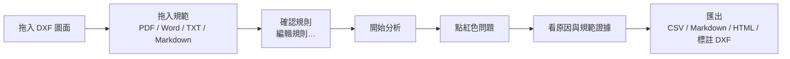

# 工程管線檢查（Engineering Route Inspector）

在自己的電腦上檢查 DXF 圖面中的電纜／管線路徑，是否符合從規範文件整理出來的規則。
程式只在本機（`127.0.0.1`）執行，不上傳任何工程資料。

## 快速開始

| 系統 | 做法 |
|---|---|
| Windows | 雙擊 `start-ui.bat` |
| Linux / macOS | 執行 `./start-ui.sh` |

第一次執行會：

1. 在資料夾內建立私有的 Python 環境 `.venv`（需要已安裝 Python 3.10 以上）。
2. 依 `requirements.txt` 安裝套件（**這一步需要連網，只有第一次**；之後不再連網）。需求檔為每個套件設了版本範圍，已實測的版本：starlette 1.7.0、uvicorn 0.54.0、ezdxf 1.4.4、pymupdf 1.28.2、python-docx 1.2.0、python-multipart 0.0.32、psutil 7.2.2。
3. 啟動程式並開啟瀏覽器（預設網址 `http://127.0.0.1:8765/`；埠被占用時自動改用下一個可用的埠，實際網址會顯示在視窗中）。

關閉啟動視窗即結束程式。啟動時可加參數，例如 `start-ui.bat --port 9000 --no-browser`。

> 第一次試用：按畫面上方的「**載入示範專案**」，再按「**開始分析**」，不需要準備任何檔案。

## 使用流程



不需要懂 Python、JSON、SQLite、REST 或 DXF 內部結構。

### 結果的意義

| 狀態 | 意義 |
|---|---|
| PASS | 實測值符合規則 |
| WARNING | 符合規則，但落在規則設定的警示範圍內 |
| FAIL | 不符合規則 |
| UNKNOWN | 資訊不足，無法判定（例如兩條線交叉但圖面沒有高程資料，或物件沒有可量測的方向）；需要人工確認 |

點選一筆問題，右側會列出：Handle、圖層 Layer、實測值 Measured、規則要求 Required、規則 Rule、規範證據 Evidence，
並在圖面上標出相關物件。

### 規範證據與「信心」

規則可以連結規範原文中的一段文字作為證據。信心的意義依規則種類而不同：

- **有數值的規則**（距離、淨距、長度、角度等）：系統檢查原文是否含有與規則相同的**數值與單位**
  （單位換算成 mm 或度後比較；`300 mm` 與 `300 cm` 不視為相同；沒有單位的數字不會被視為相符）。
  相符時信心標為 CONFIRMED，並註明「比較方向與適用對象仍需人工確認」。
- **沒有數值可比對的規則**（不得進入區域、不得交叉、物件數量等）：只確認規則已連結到匯入的規範原文，
  說明文字會寫「此類規則沒有數值可與原文比對」；CONFIRMED 在這裡只代表「有連結證據」。

兩種情況都不判斷原文的語意（例如是「不得小於」還是「不得大於」，適用於哪種管線），這部分必須由人確認。

### 規則

「編輯規則…」提供 9 種句型範本（水平淨距、垂直淨距、不得交叉、不得進入區域、必須位於區域內、
附近必須有、單一物件長度上限、必須水平或垂直、至少要有幾個物件），填入圖層或系統名稱與數值即可；
範本會從規範文件中抓出附近出現的「數值＋單位」當作建議值。規則存檔前會驗證，格式錯誤會以中文說明原因。

### 匯出

- **CSV**：每筆結果一列；以 `=`、`+`、`-`、`@` 開頭的文字會加上防止試算表當成公式的前綴。
- **Markdown**：摘要與問題清單，特殊字元已跳脫。
- **HTML 報告**：單一檔案、可離線開啟，不載入任何外部資源。
- **標註 DXF**：在原圖基礎上另存新檔，加上標註圖層；**不會修改你的來源 DXF**。

## 資料與隱私

- 所有資料放在 `data/`（可用環境變數 `ERI_DATA_DIR` 或 `--data-dir` 指定）：資料庫 `eri.sqlite3`、
  `projects/<專案>/` 下的圖面與規範副本和匯出檔、`logs/` 下的記錄。
- 程式讀取你拖入的檔案（複製一份到 `data/`）、程式資料夾內的示範檔與網頁檔案；不讀取其他資料夾、瀏覽器資料或帳號憑證。
- 程式本身不對外連線。**唯一的網路使用**是 `start-ui.bat` / `start-ui.sh` 第一次執行時，由 pip 下載
  `requirements.txt` 列出的套件。
- 「診斷」按鈕可下載診斷 ZIP：內容為版本、環境、健康檢查、資料庫統計、近期失敗的分析與程式記錄。
  設計上**不含圖面、規範、規則的內容與檔名**：路徑以 `<data>`、`<app>`、`<home>` 取代，資料庫中已知的檔名以 `<file>` 取代，例外訊息（可能引用檔案內容或規則樣式）只保留例外的類別，失敗分析只顯示階段與第幾條規則。
  這些做法各有測試，但無法證明沒有其他入口；要提供給別人之前，建議先自行打開 ZIP 檢查。程式不會自動傳送它。
- 刪除專案會一併刪除其資料庫紀錄與 `data/projects/<專案>/` 內的檔案。

## 安全設計

- 只綁定 `127.0.0.1`（`::1`、`localhost`）；設定其他位址會被拒絕，沒有 `0.0.0.0` 選項。
- 檢查 `Host` 與 `Origin`；所有 API（含下載）會拒絕跨網站的請求（`Sec-Fetch-Site`），改變資料的 API 另外需要程式啟動時產生的 token。
- 檔名與路徑經過驗證，防止跳出專案資料夾（path traversal）；上傳大小在串流過程中限制
  （圖面 200 MB、規範 50 MB、JSON 5 MB）。
- 頁面使用不含 `unsafe-inline` 的 CSP；錯誤訊息不含堆疊追蹤與絕對路徑；記錄檔中的控制字元會被跳脫。
- NaN／Infinity 與格式不符的規則會被拒絕（回應 4xx），不會寫入資料庫。
- 不提供 WebSocket：伺服器以 uvicorn 的 `ws="none"` 啟動（測試伺服器相同），不會載入任何 WebSocket 函式庫；
  升級為 WebSocket 的請求不會得到 `101`。

**限制**：token 存在於頁面中，同一台電腦上能讀取你瀏覽器頁面或程式記憶體的其他程式可以取得它；
本程式的防護對象是網頁與其他網路來源，不是同一使用者帳號下的惡意程式。

## 已知限制

- 只支援 DXF 圖面；DWG 需先自行轉成 DXF。距離以 2D 平面量測；Z 高程只用於垂直淨距，以及判斷在平面上交疊的物件是否在同一高度，圖面沒有 Z 資料時該項回報 UNKNOWN。
- 單位依 DXF 的 `$INSUNITS` 換算；圖面沒有設定單位時視為 mm 並顯示提示。
- 弧線、橢圓、曲線以弦長誤差 0.1 mm 折成線段；圓的距離為精確值，圓的「包含」判斷使用 180 邊多邊形。
- DXF 物件上限 2,000,000；區塊巢狀上限 8 層；陣列插入（MINSERT）單一陣列展開上限 100,000 格。
- PDF 只讀文字層，**不做 OCR**（掃描影像頁無法作為證據）；Word 檔沒有頁碼資訊。
- 「完全位於另一物件內」目前視為與該物件相交（衝突）。
- 規則中的正規表示式以靜態檢查加上存檔時的子程序試跑（6 秒）偵測過慢的寫法；這是偵測，不是證明
  （Python 的 `re` 無法中途中斷）。分析程序若超過 60 秒沒有心跳會被視為卡住並終止；
  另有單次分析 1800 秒與 600 秒無進度的上限（環境變數 `ERI_RUN_TIMEOUT`、`ERI_STALL_TIMEOUT`、
  `ERI_PROGRESS_TIMEOUT` 可調整）。
- 問題編號（`ISS-…`）由圖面、規則、物件 Handle 與取整後的位置雜湊而成；物件位置改變後會成為新的編號。

## 疑難排解

| 現象 | 處理 |
|---|---|
| `Python 3.10 or newer was not found` | 從 python.org 安裝 Python，安裝時勾選 *Add python.exe to PATH*，再重新雙擊。 |
| `Package installation failed` | 第一次安裝需要連網（或設定好 proxy）；連線恢復後重新執行。 |
| 啟動後視窗顯示「[問題] …」 | 那是自我檢查的結果，依文字處理（資料夾不可寫入、磁碟空間不足、缺少套件等）。 |
| 瀏覽器沒有自動開啟 | 手動開啟視窗中顯示的網址。 |
| Windows 跳出 Microsoft Store 視窗 | 電腦上沒有安裝 Python（`python` 只是 Store 的捷徑）。關閉視窗，從 python.org 安裝後再重新雙擊。 |
| 分析顯示失敗 | 錯誤訊息在畫面上；「診斷」可看到最近失敗的分析並下載診斷 ZIP。 |

自我檢查也可單獨執行：`start-ui.bat --diagnose`（Linux／macOS：`./start-ui.sh --diagnose`；加 `--json` 輸出 JSON；有問題時結束碼為 1；命令列版會執行完整的資料庫檢查，「診斷」視窗用較快的快速檢查）。

## 開發與測試

```bash
python -m venv .venv && . .venv/bin/activate          # Windows: .venv\Scripts\activate
pip install -r requirements-dev.txt
pytest                                                # 單元、整合、回歸、安全、效能、瀏覽器
pytest -m "not browser and not performance"           # 較快的子集
python scripts/benchmark_geometry.py                  # 效能基準（含 DXF 讀寫）
python scripts/benchmark_rules.py                     # 只量規則引擎（不含 DXF 讀寫），可單獨看 ALL-WITHIN
python scripts/package_release.py                     # 發行用 ZIP → dist/Engineering_Route_Inspector.zip
```

- 瀏覽器測試用 Playwright 操作無頭 Chromium；沒有安裝 Playwright 或 Chromium 時會被略過
  （可用 `playwright install chromium` 安裝，或以 `ERI_CHROMIUM` 指定現有的 Chrome／Chromium）。
- 測試使用真實 DXF 檔、真實的背景分析程序與真實的伺服器。部分防護（例如啟動腳本不覆寫主機位址）另以手動移除防護、確認測試會失敗的方式檢查過；這些檢查沒有寫成自動化測試。
- 程式碼在 `src/`：`core/`（幾何、規則、問題編號、基準比對）、`importers/`、`persistence/`、`jobs/`、
  `exporters/`、`app/`（API 與網頁）。

### 製作發行用 ZIP

```bash
python scripts/package_release.py                     # 預設打包 HEAD；--ref <commit|tag>、--out <檔案> 可指定
```

- 內容來自 `git archive`，也就是 **Git 已追蹤檔案在該 commit 的內容**，不是整個工作資料夾；
  所以 `.git`、`.venv`、`data/`（專案、圖面、SQLite 與 `-wal`／`-shm`、記錄檔）、`__pycache__`、`.pytest_cache`、
  `benchmark_out/`、`dist/` 都不會進去。尚未 commit 的修改**不會**包含（會顯示警告）。
- 同一個 commit 產生同樣的位元組：成員依路徑排序、路徑一律用 `/`、時間戳記為 commit 時間、權限固定（`start-ui.sh` 保留執行權限），
  且固定 `core.autocrlf=false`，不受打包者的 Git 設定影響。`.bat` 保持 CRLF、DXF 逐位元組不變（見 `.gitattributes`）。
- 打包後會重新開啟檢查：不得有禁止成員、絕對路徑、`..`、反斜線；必要檔案（`README.md`、`requirements.txt`、
  `start-ui.bat`、`start-ui.sh`、`src/app/server.py`、`demo/…`）必須存在。若有「已追蹤但不應出貨」的檔案，**整個打包失敗**，而不是默默略過。
- 不會 push、merge 或修改任何東西。

### 效能基準

`scripts/benchmark_geometry.py` 產生 100／1,000／10,000／50,000 個物件的 DXF，量測匯入與分析時間。
100 與 1,000 個物件的案例會把空間索引的結果與暴力比對逐項比較（必須完全一致）；
10,000 與 50,000 的案例不執行暴力比對，終端輸出會標示 `[SKIP]`。
結果寫入 `benchmark_out/benchmark.json`。

`scripts/benchmark_rules.py` 不經過 DXF 讀寫，直接以正式的 `evaluate_rule` 量測每條規則（含空間查詢次數、候選數與查詢時間），
並輸出整份結果的指紋，可用來逐位元比對兩個版本的輸出。實測數字請見下方「驗證狀態」。

## 驗證狀態

目前測試收集共 653 項（單元 110、整合 214、回歸 198、安全 111、效能 11、瀏覽器 9）。收集數包含依平台或環境略過的測試，不代表全部通過。

2026-10-03 在 Windows 11（10.0.26300，Intel Core Ultra 9 275HX、31.4 GB RAM）、Python 3.12.10、pytest 9.1.1、ezdxf 1.4.4、uvicorn 0.54.0 驗證。

| 項目 | 結果 |
|---|---|
| 本輪起點 HEAD `346383d`：`pytest -q -W error`（未安裝 Playwright） | 499 passed、12 skipped，159.15 秒，exit 0；9 項瀏覽器測試因未安裝 Playwright 略過 |
| 本輪修改後：`pytest -q -W error`（`ERI_CHROMIUM` 指向現有 Chrome） | **650 passed、3 skipped**，195.82 秒，exit 0；無 warnings。3 項略過：Windows 不允許的 `?` 資料夾名稱與 2 項 POSIX launcher 測試 |
| 各群組（各自執行，`-W error`） | 單元 110 passed；整合 211 passed、3 skipped；回歸 198 passed；安全 111 passed；效能 11 passed；瀏覽器 9 passed（無頭 Chrome，自動化，非人工操作） |
| 本輪發現並修正的 Windows 問題 | 上傳損毀 PDF 時 PyMuPDF 仍持有檔案，刪除被拒的上傳會 `WinError 32` → 500（只在完整套件中間歇出現，與 GC 時機有關）。改為從記憶體開啟 PDF，清理失敗也不再變成 500；新測試在舊程式碼上穩定失敗 |
| `start-ui.sh`（Linux 版啟動腳本；歷史紀錄，本輪未重驗） | 在乾淨副本實際執行：建立 `.venv`、安裝套件、啟動，首頁回 200、`/api/health` 正常、錯誤的 Host 標頭回 403 |
| `start-ui.bat` | 上一輪在真實 Windows 執行（首頁與 `/api/health` 回 200、診斷 exit code、cp950 命令列無 traceback、Ctrl+C）；**本輪未重驗** |
| 瀏覽器人工操作 | **BROWSER HUMAN TEST PENDING**：尚未由人在真實瀏覽器中操作驗收 |

**規則引擎效能（本輪，同一台機器，修改前＝`346383d`，修改後＝本次 commit；單次執行，未取平均，數字會有幾成的波動）**

瓶頸在 `entity_distance` → `_containment`：每一對候選物件都先展開圓形的 180 邊形（約 3,100 萬次 sin／cos）才判斷「是否被包含」，
而兩者的外框根本不相交。現在外框不相交時直接略過（結果與原本逐位元相同，記憶體不變）。
空間索引（格狀索引）本身不是瓶頸：50,000 個物件時 ALL-WITHIN 的 11,473 次查詢共 0.9 s。曾評估為每條規則建立「目標專用索引」，
但查詢只占 ALL-WITHIN 約 15%，預期最多省下約 10%，不值得增加索引生命週期與記憶體的複雜度，因此**沒有做**。

`python scripts/benchmark_rules.py`（不含 DXF 讀寫；規則總計／其中 ALL-WITHIN）：

| 物件數 | 修改前 | 修改後 | 結果是否相同 |
|---|---|---|---|
| 1,000 | 0.544 s／0.496 s | 0.079 s／0.060 s | 完整結果指紋相同（1,609 筆） |
| 10,000 | 6.75 s／6.21 s | 1.05 s／0.81 s | 完整結果指紋相同（16,064 筆） |
| 50,000 | 46.85 s／43.36 s | 6.78 s／5.03 s | 完整結果指紋相同（80,310 筆） |

「指紋」包含每筆結果的 issue ID、狀態、嚴重度、規則、主體與目標 Handle、量測值、位置、違規數與違規 Handle 及說明文字。
50,000 個物件的索引建立 0.046 s → 0.042 s；ALL-WITHIN 的空間查詢 11,473 次、2,491,488 個候選（修改前後相同），查詢時間 0.905 s → 0.655 s。

`python scripts/benchmark_geometry.py`（含 DXF 讀寫的完整分析時間）：

| 物件數 | 修改前 | 修改後 |
|---|---|---|
| 100 | 0.039 s | 0.007 s |
| 1,000 | 0.602 s | 0.099 s |
| 10,000 | 9.00 s | 1.33 s |
| 50,000 | 43.83 s（規則 38.85 s，其中 ALL-WITHIN 34.50 s） | 10.31 s（規則 8.63 s，其中 ALL-WITHIN 6.29 s） |

50,000 個物件的整個程序 RSS：366.8 MB → 367.0 MB（記憶體沒有增加）。100 與 1,000 個物件的「格狀索引 vs 暴力比對」完整結果比對仍全數一致。
`ALL-WITHIN` 的行為由 `tests/regression/test_all_within_parity.py` 把關：與舊版 `_containment` 逐項比對、與不用索引的參考實作比對、
與修改前程式碼產生的 golden hash 比對、並涵蓋門檻邊界、pair filter、Z 高程、WARNING 邊界、取消。

**已知且未更動的行為**：目標與主體的距離落在搜尋視窗外不到 1e-6 時，該筆結果的狀態是 PASS（容差內），
但會帶著 `violations.count = 1` 的細節。這在修改前就存在，本輪刻意不改變。

歷史效能基準（`python scripts/benchmark_geometry.py`，2026-10-02 於 Linux 容器、Python 3.11.15、ezdxf 1.4.4 執行；7 條規則，結果因機器而異；**本輪未重跑，僅供參考，不可與上面的 Windows 數字當成同一次測試**）：

| 物件數 | 分析時間 | 問題筆數 | 空間索引與暴力比對 |
|---|---|---|---|
| 100 | 0.18 s | 161 | 完整分析結果逐項一致；600 次隨機查詢一致 |
| 1,000 | 1.61 s | 1,609 | 完整分析結果逐項一致；600 次隨機查詢一致 |
| 10,000 | 20.4 s | 16,064 | 暴力比對略過；300 次隨機查詢抽樣一致 |
| 50,000 | 103.5 s | 80,310 | 暴力比對略過 |

50,000 個物件的案例結束時，基準程式的記憶體用量（RSS，整個程序，非尖峰值）約 359 MB；規則「ALL-WITHIN」（全部目標都須在距離內）占該案例分析時間約 84.5 s。
